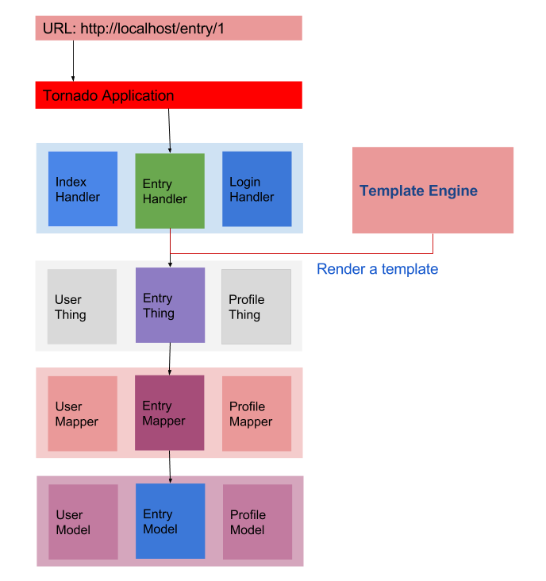

Core Concepts
++++++++++++++

Before starting writing medoly application code, it is a good idea  to have a look up the core concepts of  Medoly.

Design
================

Medoly is a fully ``MVC`` and ``RESTful`` Web Framework based tornado. flexible confiiguration and reusable logic layer.

Model
===============

Model is an object presents the application data layer. Like a blog application has ``User`` that presents user information,  and ``Post``  that presents the blog entry.

Backend (Mapper)
===================

``Backend`` (Mapper)  is a data access object that persistents your application model to database or fetchs from a rpc service and so on. Quering and building  the model, Backends can store and query models  from anywhere, such as a MySQL database service.

Thing
===============

Things  are  service logic layers include the application main logic process, mostly it binds ``Backends`` to control the model  behaviours.

Chord
===============

Chord likes ``Thing``, mostly is used to implement a thrid logic process , like data valiadte policy or third-patry service acessing.

View  and Handler
===================

Views describe how a user interface look like, render by ``Handler``  that bases  the tornado Tornado ``RequestHandler`` class.  ``Handler`` simply renders a template to frontend, or uses ``Thing`` instances to build a json view.
